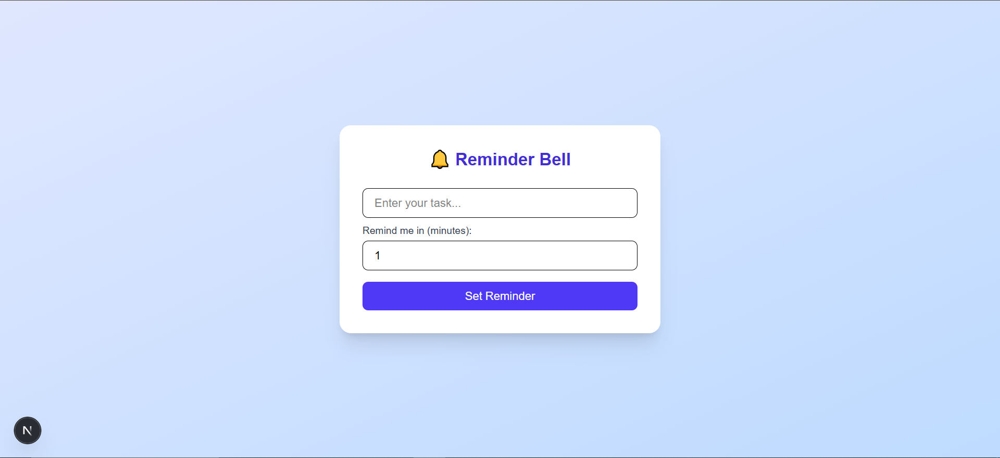

# 🔔 Reminder Bell

A simple browser-based task reminder app built with **Next.js**, **TypeScript**, **Tailwind CSS**, and **Firebase Cloud Messaging (FCM)**. Users can set quick reminders and receive push notifications in their browser.

---

## 🚀 Features

- ⏰ Set reminders for tasks with a custom delay
- 🔔 Browser push notifications using Firebase Cloud Messaging
- 📱 Responsive UI styled with Tailwind CSS
- 🔐 Handles notification permissions and browser support checks

---

## 🛠 Tech Stack

- [Next.js](https://nextjs.org/) + [TypeScript](https://www.typescriptlang.org/)
- [Tailwind CSS](https://tailwindcss.com/)
- [Firebase](https://firebase.google.com/) (Auth, Messaging)
- [VAPID Key Push Notification](https://firebase.google.com/docs/cloud-messaging/js/client)

---

## 📦 Installation

### 1. Clone the repository

```bash
git clone https://github.com/TanmayShil/reminder-bell-next-firebase-tailwindcss.git
cd reminder-bell
```
---

## 2. Install dependencies
```bash
npm install
```
---

## 3. Set up Firebase
- Go to Firebase Console
- Create a project and enable Cloud Messaging
- Go to Project Settings > Cloud Messaging and:
  - Generate a Web Push certificate key pair (VAPID key)
  - Copy the public VAPID key

---

## 4. Configure Firebase
Create firebase/firebaseConfig.ts and add your Firebase config:
```bash
const firebaseConfig = {
  apiKey: "YOUR_API_KEY",
  authDomain: "YOUR_PROJECT_ID.firebaseapp.com",
  projectId: "YOUR_PROJECT_ID",
  storageBucket: "YOUR_PROJECT_ID.appspot.com",
  messagingSenderId: "YOUR_MESSAGING_SENDER_ID",
  appId: "YOUR_APP_ID",
};
```
In messaging.ts, paste your public VAPID key:
```bash
vapidKey: "YOUR_PUBLIC_VAPID_KEY",
```
---

## ▶️ Run the App
```bash
npm run dev
```
Open http://localhost:3000 in your browser.

---

## 🔐 Permissions
- The app will request notification permission.
- Make sure to allow notifications in your browser.
- Reminders will trigger even if the browser is minimized or in another tab.

---

## 📷 Screenshots

 

---

## ✨ Credits
Created by Tanmay Shil 🚀


### ✅ Tip:
- Replace placeholders like `YOUR_API_KEY`, `your-username`, and screenshot links with real values.
- You can also add a GitHub Actions CI badge, Vercel deployment link, or live demo badge if deployed.

Let me know if you'd like a `LICENSE` file or GitHub Actions workflow setup too!

## 🙋‍♂️ Author

Made with ❤️ by Tanmay Shil
GitHub: [@TanmayShil](https://github.com/TanmayShil)
